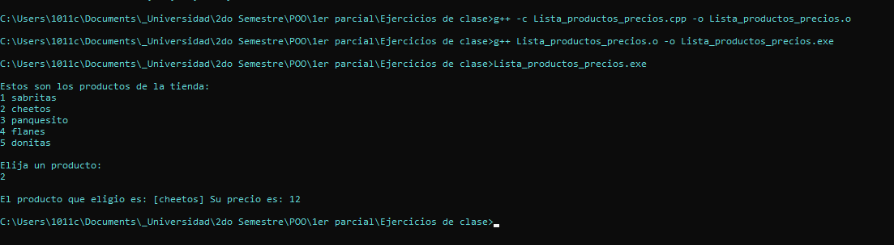
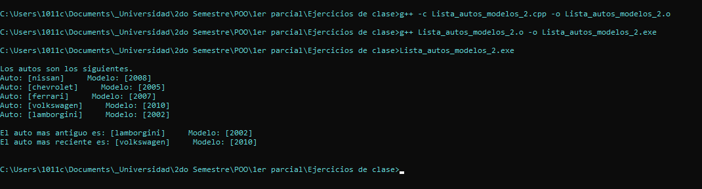
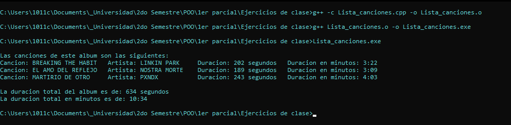
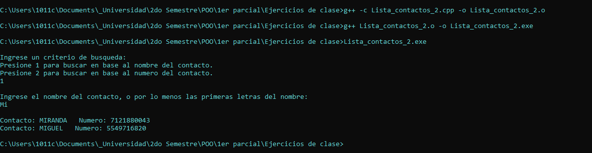
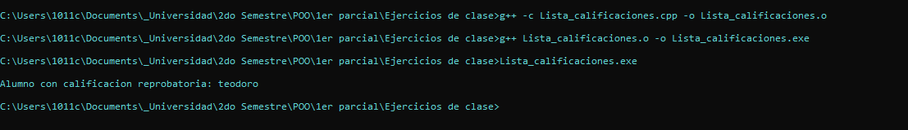

# PRÁCTICAS CON LISTAS (VECTORES Y MATRICES)
## PROGRAMACIÓN ORIENTADA A OBJETOS
### DOCENTE: ISC EDUARDO BECERRIL ROMERO
### ALUMNO: MIGUEL ÁNGEL PASCUAL MARTÍNEZ
### GRUPO: 13SC121

---
---

# ÍNDICE
1. [Introducción](#introducción)  
2. [Práctica 1](#práctica-1)  
3. [Práctica 2](#práctica-2)  
4. [Práctica 3](#práctica-3)  
5. [Práctica 4](#práctica-4)  
6. [Práctica 5](#práctica-5)  
7. [Explicación en general](#explicación-en-general)

---
# INTRODUCCIÓN
En la primer evaluación de la asignatura de **Programación Orientada a Objetos** se estan abordando conceptos basicos sobre la programación, con la finalidad de comprender las herramientas que cada lenguaje de programación pone a nuestra disposición, y con las cuales es posible dar solución a diversas problematicas, dependiendo de la situación se optan por utilizar dichas herramientas, en este caso, una de las herramientas que nos serán más útiles, son las listas, las cuales, en **C++** nos permiten almacenar varios datos del mismo tipo en una sola variable sin que la variable se sobreescriba.

---
# PRÁCTICA 1
- **Descripción:** Elaborar una lista de productos y precios, contendrá dos listas del mismo tamaño, una de precios y otra de productos, la lista mostrará los productos, el usuario elige un producto y el programa mostrará el precio.
- **Código:** Primero crearemos un archivo que se llame **Lista_productos_precios.cpp** y dentro de ese archivo escribiremos el siguiente código:
``` c++
#include <iostream>
using namespace std;

int main(){

    char productos[5][15] = {{'s','a','b','r','i','t','a','s','\0'},
                             {'c','h','e','e','t','o','s','\0'},
                             {'p','a','n','q','u','e','s','i','t','o','\0'},
                             {'f','l','a','n','e','s','\0'},
                             {'d','o','n','i','t','a','s','\0'}};
    uint16_t precios[5] = {14, 12, 29, 11, 15}, producto = 0;

    cout << endl <<"Estos son los productos de la tienda: ";

    for(size_t i = 0; i < 5; i++){
        cout << endl << i + 1 << " ";
        for(size_t j = 0; j < 10; j++){
            cout<<productos[i][j];
        }
    }

    cout << endl << endl << "Elija un producto: " << endl; cin >> producto;
    
    if ((producto < 1) || (producto > 5)){
        cout << endl << "Lo lamentamos, el producto especificado no esta disponible" << endl;
        return 1;
    } 

    cout << endl << "El producto que eligio es: [";

    for(size_t i = 0; i < 15; i++){
        if (productos[producto - 1][i] == '\0'){
            break;
        } else {
            cout << productos[producto - 1][i];
        }
    }

    cout << "] Su precio es: " << precios[producto - 1] << endl;

    return 0;
}
```
- **Explicación:** La lógica del funcionamiento del programa es que, a la lista se le agregan los valores al declararlos, posteriormente se muestran sus valores haciendo un recorrido de sus posiciones con la ayuda de los bucles **for**.
Despues se pregunta cual de los productos quiere el usuario saber el precio, al introducir un valor, el programa resta -1 a la petición del usuario para poder mostrar el producto y precios correspondientes. [Explicación en general](#explicación-en-general)
- **Capturas:** Ahora necesitamos ejecutar el programa. Pero recuerda que estamos utilizando **C++** por lo que primero necesitamos compilarlo, para ello hacemos uso de los siguientes comandos: 
```
> g++ -c Lista_productos_precios.cpp -o Lista_productos_precios.o
> g++ Lista_productos_precios.o -o Lista_productos_precios.exe
> Lista_productos_precios.exe
```

Al final nos debe de mostrar lo siguiente:


---
# PRÁCTICA 2
- **Descripción:** Elaborar una lista de autos y modelos, contiene dos listas, autos y modelos, estará en desorden, el programa mostrará el auto más antiguo y más reciente.
- **Código:** Primero crearemos un archivo que se llame **Lista_autos_modelos_2.cpp** y dentro de ese archivo escribiremos el siguiente código:
```c++
#include <iostream>
using namespace std;

int main(){

    char autos[5][15] = {{'n','i','s','s','a','n'},
                         {'c','h','e','v','r','o','l','e','t'},
                         {'f','e','r','r','a','r','i'}, 
                         {'v','o','l','k','s','w','a','g','e','n'},
                         {'l','a','m','b','o','r','g','i','n','i'}};
    uint16_t modelos[5] = {2008, 2005, 2007, 2010, 2002}, antiguo = 0, reciente = 0, posicion_antiguo = 0, posicion_reciente = 0;   

    antiguo = modelos[0];
    reciente = modelos[0];
    
// Codigo para averiguar el auto mas reciente y mas antiguo
    for (size_t i = 0; i < 5; i++){        
        if (antiguo > modelos[i]){
            antiguo = modelos[i];
        } 
        if (reciente < modelos[i]){
            reciente = modelos[i];
        }
    }    

// Codigo para saber que posicion mostrar     
    for (size_t i = 0; i < 5; i++){
        if (antiguo == modelos[i]){
            break;
        } else {
            posicion_antiguo ++;
        }
    }

    for (size_t i = 0; i < 5; i++){
        if (reciente == modelos[i]){
            break;
        } else {
            posicion_reciente ++;
        }
    }

// Mostrar los autos
    cout << endl << "Los autos son los siguientes." << endl;

    for (size_t i = 0; i < 5; i++){
        cout << "Auto: [";
        for(size_t j = 0; j < 15; j++){            
            if (autos[i][j] == '\0'){
                break;
            } else {
                cout << autos[i][j];
            }
        }
        cout << "]     Modelo: [" << modelos[i] << "]" << endl;
    }

// Mostrar autos antiguo y reciente
    cout << endl << "El auto mas antiguo es: [";
    for(size_t i = 0; i < 15; i++){
        if (autos[posicion_antiguo][i] == '\0'){
            break;
        } else {
            cout << autos[posicion_antiguo][i];
        }
    }
    cout << "]     Modelo: [" <<modelos[posicion_antiguo] << ']' << endl;

    cout << "El auto mas reciente es: [";
    for(size_t i = 0; i < 15; i++){
        if (autos[posicion_reciente][i] == '\0'){
            break;
        } else {
            cout << autos[posicion_reciente][i];
        }
    }
    cout << "]     Modelo: [" << modelos[posicion_reciente] << ']' << endl << endl;

    return 0;

}    
```
- **Explicación:** También se declaran los arreglos al inicio, para mostrar sus valores se hace uso de dos ciclos for, pero para poder encontrar los autos con modelo reciente y antiguo, se utilizan auxiliares que permiten almacenar los modelos e ir comparandolos y sustituyendolos segun corresponda, y para ir encontrando las posiciones, es necesario de que se comparen los modelos ya encontrados con los de la lista e ir utilizando una variable que incremente cada que se recorre una posición, cuando se encuentra el valor se detiene, teniendo la posición para finalmente sólo mostrar los datos. [Explicación en general](#explicación-en-general)  
- **Capturas:** Ahora necesitamos ejecutar el programa. Pero recuerda que estamos utilizando **C++** por lo que primero necesitamos compilarlo, para ello hacemos uso de los siguientes comandos: 
```
> g++ -c Lista_autos_modelos_2.cpp -o Lista_autos_modelos_2.o
> g++ Lista_autos_modelos_2.o -o Lista_autos_modelos_2.exe
> Lista_autos_modelos_2.exe
```

Al final nos debe de mostrar lo siguiente:


---
# PRÁCTICA 3
- **Descripción:** Elaborar una lista de canciones, artistas y duración, contiene tres listas, el programa mostrará la lista de canciones y artistas a las que pertenece, mostrará la duración de la lista de reproducción (tanto en segundos como en minutos).
- **Código:** Primero crearemos un archivo que se llame **Lista_canciones.cpp** y dentro de ese archivo escribiremos el siguiente código:
```c++
#include <iostream>
using namespace std;

int main(){

    char cancion[3][20] = {{'B','R','E','A','K','I','N','G',' ','T','H','E',' ','H','A','B','I','T','\0'},
                           {'E','L',' ','A','M','O',' ','D','E','L',' ','R','E','F','L','E','J','O','\0'},
                           {'M','A','R','T','I','R','I','O',' ','D','E',' ','O','T','R','O','\0'}};

    char artista[3][15] = {{'L','I','N','K','I','N',' ','P','A','R','K','\0'},
                           {'N','O','S','T','R','A',' ','M','O','R','T','E','\0'},
                           {'P','X','N','D','X','\0'}};

    uint16_t duracion[3] = {202, 189, 243}, tamanio = 0, segundos = 0, minutos = 0;

    cout << endl << "Las canciones de este album son las siguientes: " << endl;

    for (size_t i = 0; i < 3; i++){
        cout << "Cancion: ";
        for (size_t j = 0; j < 20; j++){
            if (cancion[i][j] == '\0'){
                cout << ' ';
            } else {
                cout << cancion[i][j];
            }
        }
        cout << " Artista: ";
        for (size_t k = 0; k < 15; k++){
            if (artista[i][k] == '\0'){
                cout << ' ';
            } else {
                cout << artista[i][k];
            }
        }
        cout << " Duracion: " << duracion[i] << " segundos";
        segundos = duracion[i];
        minutos = segundos / 60;
        segundos = segundos - (60 * minutos);        
        cout << "   Duracion en minutos: " << minutos << ":";
        if ((0 < segundos) && (segundos < 10)){
            cout << 0 << segundos << endl;
        } else {
            cout << segundos << endl;
        }
    }    

    for (size_t i = 0; i < 3; i++){
        tamanio += duracion[i];
    }

    cout << endl << "La duracion total del album es de: " << tamanio << " segundos";
    segundos = tamanio;    
    minutos = segundos / 60;
    segundos = segundos - (60 * minutos); 
    cout << endl << "La duracion total en minutos es de: " << minutos << ":";
    if ((0 < segundos) && (segundos < 10)){
        cout << 0 << segundos << endl;
    } else {
        cout << segundos << endl;
    }


    return 0;
}
```
- **Explicación:** De igual manera, se recorren las posiciones con los for, pero para sumar todos los valores de un arreglo, se utiliza un ciclo en conjunto con una variable con operador de asignación acumulable que permita que en cada ciclo el valor de una variable vaya sumando los valores del arreglo, y para convertir los segundos a minutos, a la variable se le asigna el valor total de los segundos, después se divide entre 60, el resultado se almacena en la variable minutos, y para obtener los segundos que no acompletan a los minutos, únicamente se debe de multiplicar los minutos por 60 y eso restárselos a los segundos totales, el resultado obtenido se almacenará en la variable segundos nuevamente. [Explicación en general](#explicación-en-general)  
- **Capturas:** Ahora necesitamos ejecutar el programa. Pero recuerda que estamos utilizando **C++** por lo que primero necesitamos compilarlo, para ello hacemos uso de los siguientes comandos: 
```
> g++ -c Lista_canciones.cpp -o Lista_canciones.o
> g++ Lista_canciones.o -o Lista_canciones.exe
> Lista_canciones.exe
```

Al final nos debe de mostrar lo siguiente:



---
# PRÁCTICA 4
- **Descripción:** Elaborar una lista de contactos, y números telefónicos, el programa contiene dos listas del mismo tamaño, el programa permite ingresar un criterio de búsqueda, y debe mostrar los contactos con su número que contengan ese criterio.
- **Código:** Primero crearemos un archivo que se llame **Lista_contactos.cpp** y dentro de ese archivo escribiremos el siguiente código:
```c++
#include <iostream>
using namespace std;

int main(){

    char contactos[3][10] = {{'C','A','R','L','O','S'},
                             {'M','I','R','A','N','D','A'},
                             {'M','I','G','U','E','L'}}, 
        numeros[3][10] = {{'7','1','2','1','8','7','7','5','8','7'},
                          {'7','1','2','1','8','8','0','0','4','3'}, 
                          {'5','5','4','9','7','1','6','8','2','0'}},
        nombre_contacto[10], numero[10];
    
    uint16_t opcion = 0;             
    
    bool posicion = true;

    cout << endl << "Ingrese un criterio de busqueda: ";
    cout << endl << "Presione 1 para buscar en base al nombre del contacto. ";
    cout << endl << "Presione 2 para buscar en base al numero del contacto. " << endl;
    cin >> opcion;

    if (opcion == 1){
        cout << endl << "Ingrese el nombre del contacto, ";
        cout << "o por lo menos las primeras letras del nombre: " << endl;         
        cin >> nombre_contacto;

// Codigos para convertir a mayusculas los caracteres.        
        for (size_t i = 0; i < 10; i++){
            if (nombre_contacto[i] != '\0'){
                if ((96 < nombre_contacto[i]) && nombre_contacto[i] < 123){
                    nombre_contacto[i] = nombre_contacto[i] - 32;
                }
            } else {
                break;
            }            
        }

    } else if (opcion == 2){
        cout << endl << "Ingrese el numero del contacto, ";
        cout << "o por lo menos ingrese los primeros digitos de su numero: " << endl;
        cin >> numero;
    } else {
        cout << endl << "Lo lamentamos, el criterio de busqueda que ingreso, no esta disponible." << endl;
    }

    if (opcion == 1){
        for (size_t i = 0; i < 3; i++){
            posicion = true;
            for (size_t j = 0; j < 10; j++){
                if (nombre_contacto[j] != '\0'){
                    if (nombre_contacto[j] != contactos[i][j]){
                        posicion = false;
                        break;
                    }
                } else {
                    break;
                }
            }            
            if (posicion){
                cout << endl;
                cout << "Contacto: ";
                for(size_t k = 0; k < 10; k++){
                    if (contactos[i][k] != '\0'){
                        cout << contactos[i][k];
                    } else {
                        break;
                    }                    
                }
                cout << "   Numero: ";
                for(size_t l = 0; l < 10; l++){
                    cout << numeros[i][l];
                }
            }
        } 

    } else if (opcion == 2){
        for (size_t i = 0; i < 3; i++){
            posicion = true;
            for (size_t j = 0; j < 10; j++){
                if (numero[j] != '\0'){
                    if (numero[j] != numeros[i][j]){
                        posicion = false;
                        break;
                    }
                } else {
                    break;
                }
            }
            if (posicion){
                cout << endl << "Contacto: ";                
                for (size_t k = 0; k < 10; k++){
                    if (contactos[i][k] != '\0'){
                        cout << contactos[i][k];
                    } else {
                        break;
                    }
                }
                cout << "   Numero: ";
                for (size_t l = 0; l < 10; l++){
                    cout << numeros[i][l];
                }
            }
        }        
    } 

    cout << endl;

    return 0;
}
```
- **Explicación:** Para poder lograr el funcionamiento de este programa fue necesario de estructuras repetitivas for y estructuras de control if - else if - else. El programa primero pregunta la forma de búsqueda, posterior a eso, solicita el dato según corresponda, cabe mencionar que el programa analiza los datos ingresados, en caso de elegir una búsqueda en base al nombre, si se ingresan palabras con letras en minúsculas, éste convertirá las minúsculas a mayúsculas con la ayuda de un ciclo for y de los valores de la tabla ascii (las letras mayúsculas tienen un valor de entre 65 y 90, mientras que las minúsculas tienen valores de entre 97 y 122) para convertirlos únicamente resta el valor de la letra minúscula en - 32 para obtener la misma letra pero en mayúscula, y para poder mostrar los datos parecidos requiere de una comparacion caracter por caracter, cada recorrido el programa cambiara el valor de una variable booleana dependiendo de si los caracteres comparados eran iguales o no, y si al terminar un recorrido, todos los caracteres fueron correctos, el contacto se mostrará junto con su número telefónico. [Explicación en general](#explicación-en-general)  
- **Capturas:** Ahora necesitamos ejecutar el programa. Pero recuerda que estamos utilizando **C++** por lo que primero necesitamos compilarlo, para ello hacemos uso de los siguientes comandos: 
```
> g++ -c Lista_contactos.cpp -o Lista_contactos.o
> g++ Lista_contactos.o -o Lista_contactos.exe
> Lista_contactos.exe
```

Al final nos debe de mostrar lo siguiente:



---
# PRÁCTICA 5
- **Descripción:** Elaborar un lista de alumnos y calificaciones, el programa contendrá dos listas del mismo tamaño, el programa debe mostrar aquellos alumnos con calificaciones que se consideren reprobatorias.
- **Código:** Primero crearemos un archivo que se llame **Lista_calificaciones.cpp** y dentro de ese archivo escribiremos el siguiente código:
```c++
#include <iostream>
using namespace std;

int main(){

    char alumnos[3][10] = {{'f','e','r','n','a','n','d','o'},
                           {'t','i','a','g','o'},
                           {'t','e','o','d','o','r','o'}};
    uint16_t calificaciones[3][6] = {{5,6,4,7,8,9},
                                     {9,8,0,7,6,9},
                                     {6,6,5,3,6,4}}, 
            calificacion = 0;

    for (size_t i = 0; i < 3; i ++){
        for (size_t j = 0; j < 6; j++){
            calificacion += calificaciones[i][j];
        }
        if (calificacion <= 30){
            cout << endl << "Alumno con calificacion reprobatoria: ";
            for (size_t k = 0; k < 10; k++){
                cout << alumnos[i][k];
            }
            cout << endl;     
        }
        calificacion = 0;        
    }


    return 0;
}
```
- **Explicación:** Lo único que se realizó fue utilizar una variable que con la ayuda de un bucle for pudiese sumar todos los valores de un arreglo, para posterormente evaluar si la suma era mayor a lo necesario para aprobar, de lo contrario, el programa mostraría en pantalla al alumno con calificación reprobatoria. [Explicación en general](#explicación-en-general)  
- **Capturas:** Ahora necesitamos ejecutar el programa. Pero recuerda que estamos utilizando **C++** por lo que primero necesitamos compilarlo, para ello hacemos uso de los siguientes comandos: 
```
> g++ -c Lista_calificaciones.cpp -o Lista_calificaciones.o
> g++ Lista_calificaciones.o -o Lista_calificaciones.exe
> Lista_calificaciones.exe
```

Al final nos debe de mostrar lo siguiente:


---

# EXPLICACIÓN EN GENERAL
En este apartado se da a conocer los elementos que se usaron en todos los programas.  

**variables** Son espacios en memoria que pueden almacenar datos.  

**char** Es un tipo de dato, el cual solo puede almacenar un caracter.

**vectores** Son agrupaciones de variables, los vectores permiten almacenar varios datos sin tener que perderderlos cada que se quiere almacenar un nuevo dato.

**matrices** Son arreglos bidimensionales, estos son arreglos dentro de arreglos, poseen filas y columnas, pero su objetivo es el mismo que el de los vectores.

**int** Es un tipo de dato que puede almacenar valores numéricos enteros.  

**#include** Indica que se mandar a llamar una libreria del lenguaje.  

<**iostream**> Es una libreria que funciona para poder realizar salidas (mensajes) y entradas de datos (desde el teclado).   

**libreria** Agrupación de clases, funciones, y/o clases de espacios de nombres.

**using namespace std** Es utilizado para decirle al programa que se va a utilizar un espacio de nombres estandar, los cuales son conjuntos de clases y/o funciones.    

**return** Es una palabra reservada que indíca que al terminar ciertas instrucciones, regresará un valor.  

**uint16_t** Es otro tipo de dato que almacena valores enteros, a diferencia de que éste sólo almacena valores positivos, y con un máximo de 16 bit.

**bool** Es otro tipo de dato, pero éste sólo puede almacenar dos valores, **true** o **false**, estos dos valores son los responsables de que una condición se cumpla o no.

**if** Es una palabra reservada que indica que se va a utilizar una condición, si es verdadera hara lo que esta dentro de su condición, pero si no se cumple, pueden pasar dos cosas, que se ejecute un **else if** que tiene la misma funcionalidad, o que se ejecute un **else** que se ejecutará cuando ninguna de las condiciones se cumplan.

**for** Es una estructura cíclica que, como su nombre lo dice, cicla código siempre y cuando una condición se cumpla.

**break** Su traducción significa freno, y eso mismo es lo que hace, detener un proceso, por ejemplo, es utilizado en los bucles o ciclos.

**[i]** Ésto hace referencia al índice de una lista, un vector sólo tiene un índice, mientras que una matriz tiene dos índices, los índices o posiciones, simpre inician en 0. 

**//** Significa que se colocará un comentario de una sola línea, los comentarios no son leidos por el programa, así que no afectan en nada al código, pero se utilizan para poder colocar notas de para que sirven ciertas lineas de código por ejemplo.